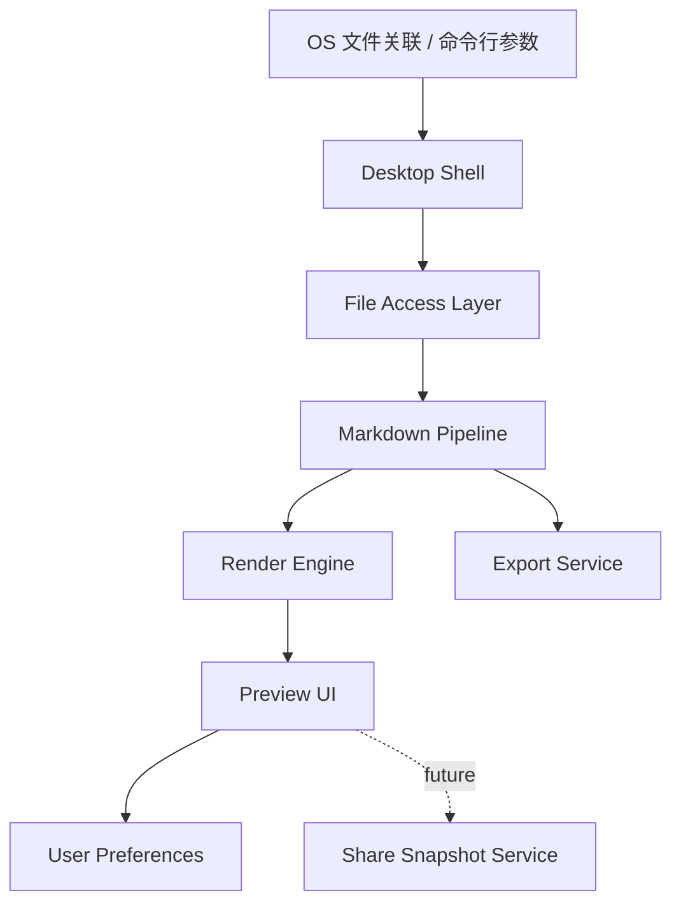
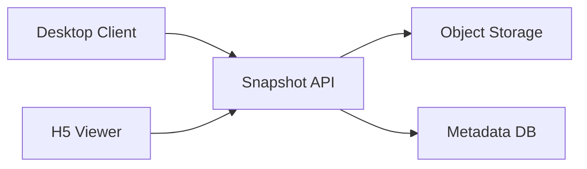

# SnapMD 闪阅 —— 架构决策与分阶段落地方案（修订版）

> 修订日期：2026-06-16
> 适用阶段：立项评审 / 技术选型拍板 / MVP 排期
> 文档目标：将现有“技术选型方案 + 深度审查报告”收敛为一份可执行的架构决策稿

---

## 一、执行摘要

基于现有方案与审查报告，SnapMD 的核心判断如下：

1. **产品必须先收边界，再做技术决策**
   - `本地 Markdown 预览器` 与 `云端分享平台` 应视为两阶段产品，而不是一个同时起跑的系统。
   - MVP 成功标准应聚焦在：`打开快`、`渲染准`、`导出稳`、`零配置可用`。

2. **推荐主路线：Tauri 2 + Web 前端，先做桌面端 MVP**
   - 如果团队具备 Rust/Web 工程能力，Tauri 方案在 Markdown 渲染、主题系统、Mermaid、导出、后续分享页复用方面更顺手。
   - Avalonia 不应被否定，但更适合作为对照 PoC，而不是当前默认主路线。

3. **必须新增两个“决定成败”的设计对象**
   - `Rendering Contract（渲染契约）`
   - `Share Trust Model（分享信任模型）`

4. **正式开发前增加 Phase 0**
   - 用 1 周完成双栈 Spike，基于统一样本做决策，而不是先写死技术栈再验证。

---

## 二、产品边界重定义

### 2.1 产品分层

SnapMD 不是一个单体需求，而是两个复杂度完全不同的产品层：

| 层级 | 核心目标 | 复杂度来源 | 是否进入 MVP |
|------|----------|------------|--------------|
| 桌面预览器 | 双击打开、本地渲染、快速预览 | 文件关联、渲染一致性、性能、导出 | 是 |
| 分享服务 | 生成链接、移动端查看、访问控制 | 存储、安全、审核、合规、运维 | 否 |

### 2.2 MVP 产品定义

MVP 应定义为：

> 一个安装后可直接关联 `.md` 文件、可稳定渲染常见 Markdown 文档、支持基础主题与导出能力的轻量桌面预览器。

MVP **不包含**：

- 多人协作
- 插件系统
- 主题市场
- 小程序端
- 企业版能力
- 复杂账号体系

### 2.3 为什么必须这样收边界

如果在 MVP 同时推进桌面端、云分享、移动端、小程序与商业化能力，会同时引入以下非线性复杂度：

- 桌面端：文件关联、打包、签名、更新
- 渲染层：Markdown 方言兼容、图片路径、代码高亮、打印导出
- 服务端：鉴权、存储、审计、内容治理、生命周期清理
- 运营侧：隐私政策、用户支持、投诉处理、成本控制

这会让“轻量预览器”的核心价值被分散。

---

## 三、技术路线决策

### 3.1 推荐结论

当前建议采用：

```text
主路线：
Tauri 2 + Vue 3 + TypeScript + Markdown 渲染链

对照路线：
Avalonia 11 + .NET 稳定 LTS + Markdig / Markdown.Avalonia
```

### 3.2 为什么主推 Tauri

Tauri 更适合 SnapMD 当前阶段，原因不是“更先进”，而是它与产品形态更贴合：

1. **Markdown 渲染天然受益于 Web 生态**
   - GFM、Mermaid、代码高亮、目录导航、打印样式、主题切换都更成熟。

2. **桌面端与分享页可以复用渲染资产**
   - 本地预览和未来 H5 分享页可共用一套样式体系、渲染规则和测试样本。

3. **开发效率更高**
   - 对以文档渲染为核心的产品，HTML/CSS 的表达力远高于手拼原生控件树。

4. **后续导出能力更顺**
   - HTML -> Print/PDF 的链路比“Markdown -> 原生控件 -> PDF”更容易收敛一致性。

### 3.3 Avalonia 的定位

Avalonia 仍然值得保留，但定位应调整为：

- 用于验证极限冷启动、低内存占用、原生文件关联体验
- 作为技术保底路线，而不是默认落地主线

不建议继续沿用“先选 Avalonia，再想办法把 HTML 塞进 UI”的思路。真正合理的 Avalonia 路线只有两类：

1. 彻底使用原生控件渲染 Markdown
2. 明确接受 WebView 作为渲染容器

两者都比原方案伪代码更真实，但工程代价不同。

---

## 四、架构原则

### 4.1 总原则

1. **本地优先**
   - 没有分享服务时，产品也必须成立。

2. **渲染优先于功能堆叠**
   - 渲染正确性是产品口碑底盘。

3. **可验证优先于可描述**
   - 每个关键判断都应能用样本、指标、截图或自动化用例验证。

4. **安全能力后置，但安全边界前置**
   - 即便分享功能不进入 MVP，也要提前确定未来信任模型。

### 4.2 架构分层



### 4.3 桌面端核心模块

| 模块 | 职责 | MVP 是否必需 |
|------|------|--------------|
| 文件入口层 | 双击打开、命令行打开、拖拽打开、最近文件 | 是 |
| 文件访问层 | 读取文本、检测编码、解析相对路径 | 是 |
| Markdown 管线 | 解析、扩展、清洗、生成结构/HTML | 是 |
| 渲染层 | 页面排版、代码高亮、目录、锚点跳转 | 是 |
| 监听层 | 文件变更自动刷新、防抖 | 是 |
| 导出层 | PDF / HTML 导出 | 是 |
| 设置层 | 主题、字体、滚动位置、语言 | 是 |
| 分享层 | 快照上传、过期、密码、访问控制 | 否 |

---

## 五、必须补齐的渲染契约

### 5.1 为什么“渲染契约”比框架更重要

SnapMD 的本质不是“做一个壳”，而是“稳定呈现 Markdown 最终效果”。  
只讨论 Tauri 还是 Avalonia，不定义渲染契约，后面一定会反复返工。

### 5.2 建议支持范围

MVP 建议明确支持：

- CommonMark 基础语法
- GFM：
  - 表格
  - 任务列表
  - 删除线
  - 自动链接
- 代码高亮
- TOC 生成
- 图片渲染
- 引用块
- 脚注

MVP 可选支持：

- Mermaid
- Frontmatter 元数据
- 数学公式

MVP 暂不承诺：

- 任意内嵌 HTML 的完整兼容
- 插件注入式扩展语法

### 5.3 渲染安全与一致性规则

需要明确写入方案的规则：

1. 是否允许原始 HTML
2. 若允许，是否做白名单 sanitize
3. 本地图片与相对路径如何解析
4. 缺失资源如何降级
5. 大文件是否做分段渲染或虚拟滚动
6. 导出 PDF 与屏幕渲染是否要求样式一致

### 5.4 建议建立样本文档集

在仓库中新增 `render-fixtures/`，至少包含：

- `basic.md`
- `gfm-table.md`
- `code-highlight.md`
- `long-document.md`
- `image-relative-path.md`
- `mermaid.md`
- `unsafe-html.md`
- `print-export.md`

所有技术选型、回归测试、导出验证都基于同一批样本完成。

---

## 六、分享功能必须先定信任模型

### 6.1 核心问题

当前讨论中，“匿名上传”“密码保护”“访问统计”“自动审核”“隐私合规”被放在一起，但它们并不天然兼容。

分享功能必须先选模型，而不是先罗列特性。

### 6.2 建议优先选择的模型

建议 Phase 2 只做：

> **私密快照分享**

定义如下：

- 分享对象是“某次渲染结果快照”，不是可协作文档
- 默认非公开索引
- 默认带过期时间
- 支持可选密码
- 支持手动删除
- 支持基础访问统计

### 6.3 不建议 Phase 2 直接做的事

- 账号体系
- 多人协作编辑
- 小程序分发
- 可搜索公开广场
- 用户上传主题或插件
- 大规模内容审核体系

### 6.4 分享功能最小架构



### 6.5 最小安全规则

Phase 2 只要求以下基础能力：

- HTTPS
- 分享链接随机不可枚举
- 可选提取密码
- 7 天默认过期
- 用户可手动删除
- 基础频控
- 基础访问日志

这样既能控制复杂度，也能先验证需求真实性。

---

## 七、Phase 0：技术决策 Spike

### 7.1 目标

用 1 周时间完成双技术栈对照验证，输出可以拍板的证据，而不是主观偏好。

### 7.2 Spike 产物

两套最小可运行样例：

1. `Tauri Spike`
2. `Avalonia Spike`

都必须支持同一组能力：

- 打开本地 `.md`
- 渲染基础 Markdown
- 代码高亮
- 相对路径图片
- 文件监听自动刷新
- 导出 PDF

### 7.3 统一评分维度

| 维度 | 指标 | 说明 |
|------|------|------|
| 冷启动 | 首次打开 1MB 文档时间 | 从双击到内容可见 |
| 热切换 | 已运行状态切换文档时间 | 从文件请求到渲染完成 |
| 内存 | 空闲 / 大文档峰值 | 至少记录 1MB 与 10MB |
| 渲染正确性 | 样本文档通过率 | 与预期截图/基线比对 |
| 导出一致性 | PDF 与预览一致度 | 样式、分页、代码块 |
| 开发复杂度 | 任务实现工作量 | 文件监听、主题、导出 |
| 分发复杂度 | 打包、签名、升级难度 | 面向 Windows/macOS |

### 7.4 决策门槛

满足以下条件即可定主路线：

1. 渲染正确率 >= 90%
2. 冷启动和热切换达到 MVP 目标
3. 文件监听和 PDF 导出无结构性阻碍
4. 团队能在 4-6 周内完成 MVP

---

## 八、性能目标重写

### 8.1 不建议使用绝对口号式指标

“毫秒级”“秒开”“极低内存”适合对外宣传，不适合内部架构文档。  
架构文档应写成可测量、可复现、可验收的指标。

### 8.2 建议 KPI

| 指标 | 目标 | 备注 |
|------|------|------|
| 冷启动 P50 | <= 700ms | Windows 主目标环境，1MB 文档 |
| 冷启动 P95 | <= 1200ms | 同上 |
| 热切换 P50 | <= 150ms | 已运行状态切换文档 |
| 热刷新 P50 | <= 300ms | 文件变更到预览更新 |
| 空闲内存 | 尽量 <= 120MB | Tauri 目标值 |
| 大文档峰值内存 | <= 250MB | 10MB 文档样本 |
| 导出 PDF 耗时 | <= 3s | 10 页等价文档 |
| 崩溃率 | < 0.5% | Beta 阶段统计 |

### 8.3 测试口径

所有性能数据必须同时记录：

- 操作系统版本
- CPU / 内存规格
- 文档样本名称
- 首次启动还是缓存后启动
- 是否开启开发模式

---

## 九、分阶段路线图（修订）

### Phase 0：技术 Spike（1 周）

目标：

- 对 Tauri 与 Avalonia 做最小闭环验证
- 形成技术拍板结论

交付物：

- 双栈样例工程
- 测试样本文档集
- 指标对比表
- 最终技术决策记录

### Phase 1：桌面端 MVP（4-6 周）

目标：

- 做出一个真正可日常使用的 Markdown 预览器

范围：

- `.md` 文件关联
- 双击打开 / 拖拽打开
- 最近打开记录
- 基础 Markdown + GFM 渲染
- 代码高亮
- 主题切换（亮/暗）
- 文件监听自动刷新
- 导出 HTML / PDF
- 基础设置页
- 崩溃与错误兜底

不进入本阶段：

- 云分享
- Mermaid 以外复杂扩展
- 多语言完整覆盖

### Phase 2：私密分享 Beta（3-5 周）

目标：

- 验证“分享渲染结果”是否是真实高频需求

范围：

- 一键生成分享链接
- H5 只读预览页
- 7 天默认过期
- 可选密码
- 手动删除
- 基础访问统计

### Phase 3：体验增强（持续迭代）

可选项：

- Mermaid 正式支持
- 多语言
- 高级主题
- 收藏 / 置顶常用文件
- 移动端阅读优化

### Phase 4：商业化与平台化（后置评估）

仅在满足以下前提后再考虑：

- MVP 留存稳定
- 分享功能使用率明确
- 用户已出现付费或团队协作需求

候选方向：

- 专业版功能包
- 团队分享空间
- 企业私有部署

---

## 十、需要修改现有方案的关键结论

### 10.1 必改项

1. 删除“桌面端 + 云端 + 小程序同步起步”的表达
2. 删除不准确或不严谨的版本号描述
3. 删除 Avalonia 伪代码中的错误渲染方式
4. 将“分享功能”从主 MVP 目标中拆出
5. 补入渲染契约与样本文档集设计
6. 在路线图前新增 Phase 0 技术 Spike

### 10.2 建议保留项

1. “双击秒开”的核心产品定位
2. “轻量预览而非重编辑器”的差异化方向
3. 文件关联、导出、主题这些桌面工具核心能力
4. 对分享能力的长期判断，但仅作为 Phase 2+

---

## 十一、最终建议

如果今天必须拍板，我的建议是：

```text
产品拍板：
先做本地预览器，再验证私密分享，不同时做平台化产品。

技术拍板：
以 Tauri 2 作为主路线，以 Avalonia 作为 1 周对照 Spike。

管理拍板：
先验收渲染正确性与冷启动，再讨论主题市场、插件系统和商业化。
```

SnapMD 的机会点，不在“功能更多”，而在“把 Markdown 预览这件事做得快、准、稳、可信”。  
只要这四件事成立，后续分享、协作、商业化才值得继续叠加。

---

## 十二、建议的下一步动作

1. 以本文件为基础，替换现有立项评审用主文档
2. 本周内完成 Phase 0 Spike 任务拆解
3. 在仓库补充 `render-fixtures/` 样本集
4. 单独新建《分享功能最小安全架构说明》
5. Spike 结束后再最终确认主技术栈与 MVP 排期

---

## 十三、变更记录

| 日期 | 类型 | 内容摘要 | 变更原因 |
| --- | --- | --- | --- |
| 2026-07-07 | 功能新增 | SnapMD 新增 CSV 与 YAML/YML 文本格式支持：CSV 表格预览、列目录和列数诊断；YAML 结构目录、源码预览和 Tab 缩进诊断，并同步桌面文件关联。 | 继续扩展轻量文本类阅读能力，同时保持无重型依赖和纯文本编辑模型。 |
| 2026-07-07 | 打包优化 | Windows 一键打包脚本默认改为生成免安装便携版 exe，并复制到根目录 `releases/SnapMD-版本号-x64.exe`；安装包打包保留为 `npm run tauri:build`。 | 用户优先需要双击即可运行的单文件 exe，而不是 MSI/NSIS 安装器。 |
| 2026-07-07 | 打包修正 | SnapMD Windows WiX MSI 打包语言配置为 `zh-CN`，修复中文产品名在默认 `en-US` / codepage 1252 下触发 `LGHT0311` 导致安装包生成失败的问题。 | 保留应用中文名，同时保证 Windows MSI / NSIS 安装包可以稳定生成。 |
| 2026-07-07 | 功能新增 | SnapMD Markdown 编辑/分屏模式新增图片快速插入：Tauri 桌面模式下选择图片后自动复制到当前文档同目录 `assets/`，并在光标处插入相对路径。 | 减少用户手写 `` 的成本，同时避免使用不可移植的本地绝对路径。 |
| 2026-07-07 | 体验回调 | SnapMD 顶部工具栏模式切换恢复为“阅读 / 编辑 / 分屏”三个独立按钮；浏览器模式下图片样本会解析到 `/render-fixtures`，并对本地绝对图片路径给出不可访问提示。 | 三按钮模式比编辑/分屏合并切换更直观；浏览器开发模式不能读取任意本地磁盘图片，需要对项目内图片样本提供可访问路径和明确提示。 |
| 2026-07-07 | 体验优化 | SnapMD 导出 PDF / HTML 默认使用源文件基名；顶部工具栏将“编辑”和“分屏”合并为单个切换按钮，保留“阅读”入口。 | 让导出文件更容易和源文件对应，同时减少顶部工具条按钮数量。 |
| 2026-07-07 | 功能补齐 | SnapMD 新增图片测试样本 `image-gallery.md`，覆盖 SVG、PNG、宽图缩放和缺失图片；Markdown 渲染支持基于当前文档目录解析相对图片路径，并在 Tauri 模式下通过 asset protocol 显示本地图片。 | 补齐图片渲染功能验证，确保本地 Markdown 中常见的 `./assets/...` 图片可以被阅读器正确显示。 |
| 2026-07-07 | 体验增强 | SnapMD 新增侧栏宽度和分屏编辑/预览比例拖拽调整，宽度偏好写入本地；文件信息面板在窄侧栏下自动切为单列。 | 用户需要根据阅读场景自定义目录、编辑区和预览区空间，并在窄侧栏下保持文件信息可读。 |
| 2026-07-07 | 体验增强 | SnapMD Markdown 编辑态新增轻量源码高亮层，对标题、引用、列表、任务、代码、粗体和链接做视觉区分，同时保持纯文本编辑模型。 | 改善编辑态文字全同大小/同颜色导致的结构辨识度不足，避免过早引入完整编辑器内核。 |
| 2026-07-07 | 体验增强 | SnapMD 顶部工具条新增 `Ctrl+O` 打开、`Ctrl+S` 保存、`Ctrl+E` 切换编辑，新增 JSON 显式格式化按钮、内容字号控制、JSON 错误顶部状态提示；左下角文件信息改为双列紧凑显示，并将“同步/未监听”调整为“监听/未关联”。 | 提升日常阅读和轻量编辑效率，减少侧栏信息占用，并让文件监听状态更易理解。 |
| 2026-07-07 | 功能新增 | SnapMD 新增多格式阅读与轻量编辑底盘：支持 `.json` 正式读取、TXT 纯文本渲染、JSON 格式化预览/结构目录/语法诊断、顶部水平工具条、阅读/编辑/分屏模式、手动保存与未保存状态保护；渲染契约与 README 同步更新。 | 将 SnapMD 从 Markdown-only 预览器扩展为轻量文本类文档阅读器，同时避免编辑状态被外部刷新覆盖。 |
| 2026-06-29 | 功能新增 | SnapMD Tauri 桌面模式新增当前文件变更自动刷新：后端返回文件修改时间并提供状态查询命令，前端对当前本地路径定时检测，外部编辑保存后自动重读并更新预览；侧栏新增同步状态。 | 让 SnapMD 可以作为实时预览窗口使用，用户在外部编辑器修改 Markdown 后无需重新拖入或手动打开。 |
| 2026-06-29 | 功能新增 | SnapMD 侧栏新增“最近打开”记录：打开本地路径成功后写入最多 8 条历史，支持点击重开、单项移除和清空；README 同步补充当前能力。 | 用户希望查看之前打开过的 Markdown，不必每次重新手动拖入文件。 |
| 2026-06-29 | 功能修正 | SnapMD 桌面端改为通过 Tauri Webview 拖放事件处理全窗口 `.md` / `.markdown` / `.txt` 拖入打开；浏览器预览增加全局拖放兜底；Tauri 主窗口显式声明 `label: "main"` 与 `dragDropEnabled: true`；能力配置更新为 Tauri 2 `core:*` 权限命名。 | 修复拖拽 Markdown 文件进入应用无响应的问题，并确保打包阶段权限配置与当前 Tauri 2 版本一致。 |
